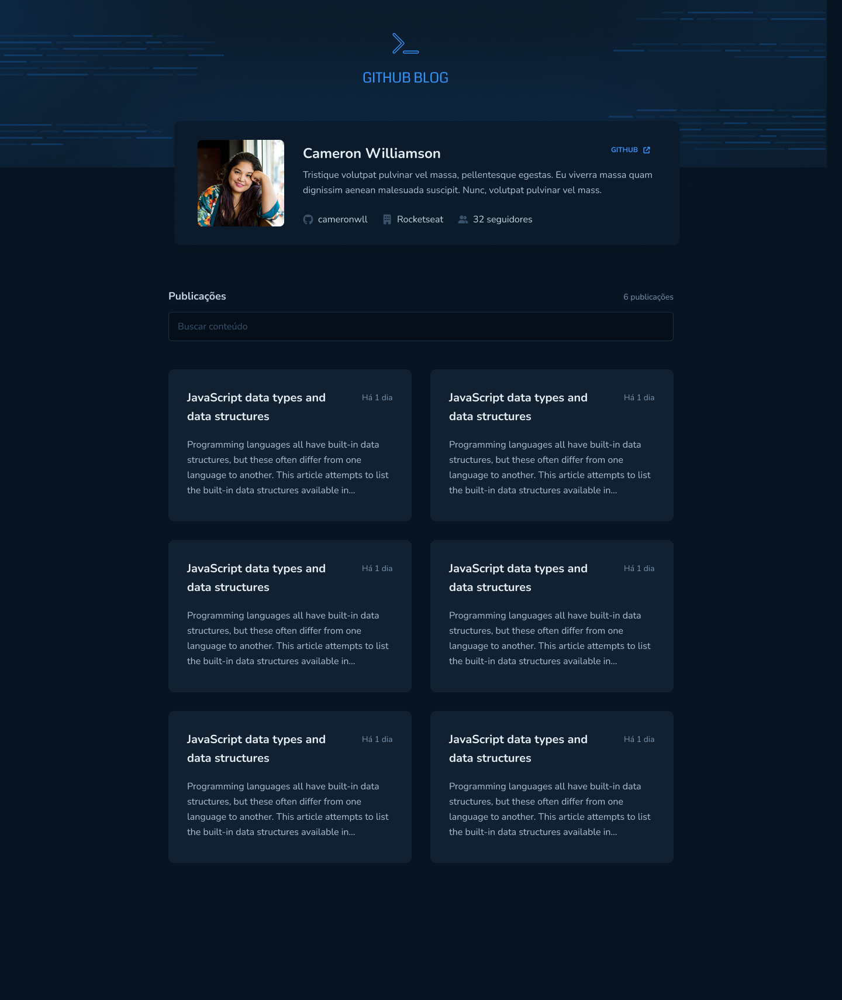
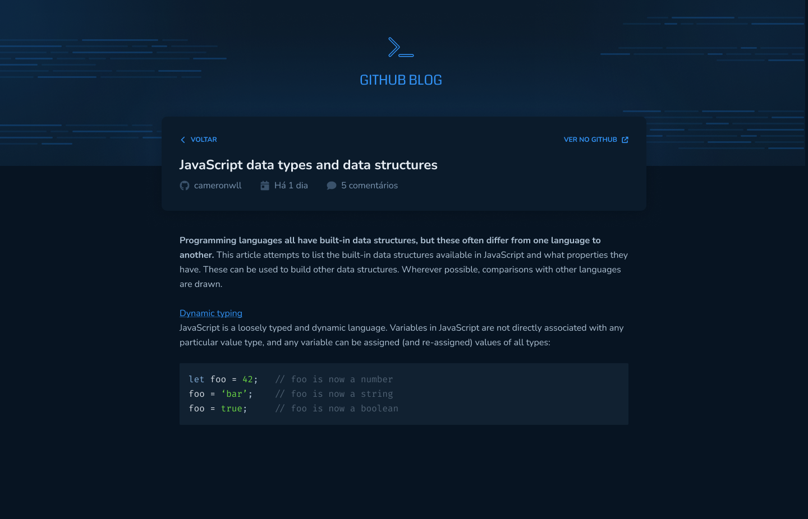

<div align="center">
  
  <div>
    <strong>Github Blog</strong>
  </div>
</div>

## 📝 O que é o Github Blog?

O Github Blog é uma aplicação para buscar issues de um repositório, dados do seu perfil e exibir elas como um blog.
Dentre as funcionalidades, temos:

- Listagem do seu perfil com imagem, número de seguidores, nome e outras informações disponíveis pela API do GitHub.
- Listar e filtrar todas as issues do repositório com um pequeno resumo do conteúdo dela.
- Criar uma página para exibir um post (issue) completo.

## 📷 Demonstração

<div align="center">
  
  
</div>

## 🚀 Tecnologias

✔️ [React](https://reactjs.org/) - Uma biblioteca JavaScript para criar interfaces de usuário.<br/>
✔️ [TypeScript](https://www.typescriptlang.org/) - TypeScript é um superconjunto de JavaScript desenvolvido pela Microsoft que adiciona tipagem e alguns outros recursos a linguagem.<br/>
✔️ [Emotion](https://emotion.sh/docs/introduction) - Biblioteca para estilização de componentes.<br/>
✔️ [Context API](https://pt-br.reactjs.org/docs/context.html) - Context fornece uma maneira de passar dados através da árvore de componentes sem ter que passar props manualmente em cada nível.<br/>
✔️ [React Hook Form](https://react-hook-form.com/) - Uma biblioteca para lidar com formulários de maneira fácil e rápida.<br/>
✔️ [Zod](https://zod.dev/) - Biblioteca para validação de dados e construção de esquemas em TypeScript.<br/>
✔️ [React Markdown](https://github.com/remarkjs/react-markdown) - Componente React para renderizar conteúdo no formato Markdown.<br/>
✔️ [Axios](https://axios-http.com/docs/interceptors) - Biblioteca para fazer requisições HTTP.<br/>

## 📁 Como baixar o projeto

```bash
# Clonar o repositório
$ git clone

# Entrar no diretório
$ cd ignite-github-blog

# Instalar as dependências
$ yarn ou npm install

# Iniciar o projeto
$ yarn dev ou npm run dev
```

## 🖊️ Autor

- [@raniellimontagna](https://www.github.com/raniellimontagna)
